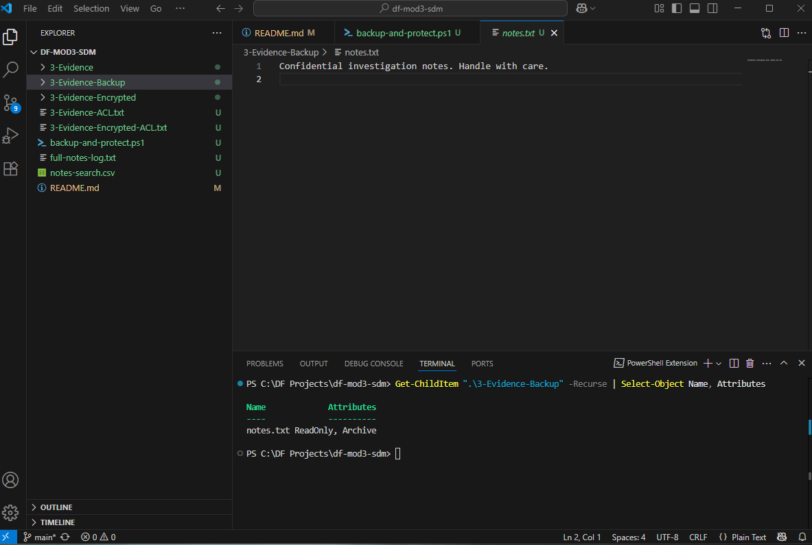

# df-mod3-sdm
## Secure Data Management

### Files & Folders

- Created `3-Evidence` and `3-Evidence-Encrypted` folders.
- Applied access control using PowerShell and redirected ACL output to:
  - `3-Evidence-ACL.txt`
  - `3-Evidence-Encrypted-ACL.txt`

### File Content Commands

- Searched for keyword `"confidential"` in `notes.txt` and exported matches to `notes-search.csv`.
- Used `Get-Content` to log full text of `notes.txt` into `full-notes-log.txt`.

### Purpose

These PowerShell tools help preserve evidence integrity and support file auditing. The exported permission logs and content snapshots serve as part of a digital evidence trail.
### 🔐 File Permissions

- Created a protected copy: `protected-notes.txt` in the `3-Evidence-Encrypted` folder.
- Used `Set-ItemProperty` to set it as **read-only**, preventing overwrites.
- Verified using `Get-Item` and confirmed the file has the `ReadOnly` attribute.
- This method helps preserve digital evidence by locking critical files from changes.

# Define source and backup folder paths
$source = ".\3-Evidence"
$backup = ".\3-Evidence-Backup"

# Create backup folder if it doesn’t exist
if (-not (Test-Path $backup)) {
    Copy-Item $source -Destination $backup -Recurse
}

# Set all items in backup folder to ReadOnly
Get-ChildItem -Path $backup -Recurse | ForEach-Object {
    Set-ItemProperty -Path $_.FullName -Name IsReadOnly -Value $true
}
## Managing Permissions

The backup folder was protected by setting every file inside to `ReadOnly`.  
This helps preserve evidence from accidental edits or overwrites.

Commands used:
```powershell
Get-ChildItem -Path $backup -Recurse | ForEach-Object {
    Set-ItemProperty -Path $_.FullName -Name IsReadOnly -Value $true
}
## PowerShell Scripting

The script `backup-and-protect.ps1` automates two key tasks:
- It checks if the `3-Evidence-Backup` folder exists and creates it if not.
- It sets all files in the backup folder to `ReadOnly` using `Set-ItemProperty`.

This scripting approach ensures repeatable, consistent digital preservation.  
Clear comments were added to describe each part of the script, improving readability and reusability.
